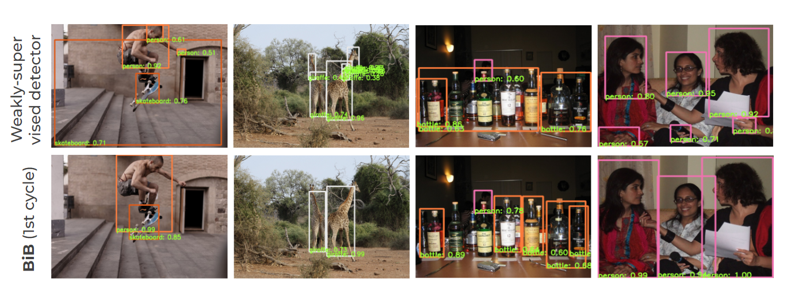
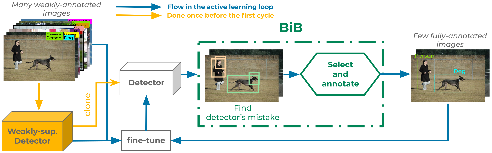
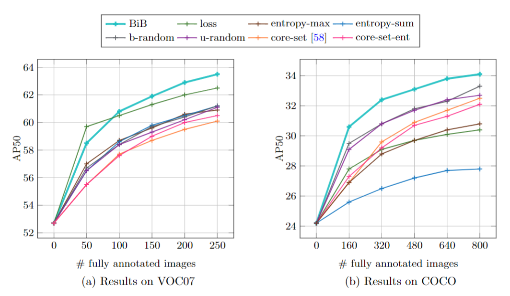

# Active Learning Strategies for Weakly-Supervised Object Detection
by *Huy V. Vo, Oriane Siméoni, Spyros Gidaris, Andrei Bursuc, Patrick Pérez and Jean Ponce*, ECCV 2022 ([paper](https://arxiv.org/abs/2207.12112)) 

Pytorch framework of our proposed Active Learning method **BiB** specifically designed for boosting weakly-supervised learning of object detectors by integrating *few well-selected fully-annotated* images. The following figure presents the benefit of the BiB selection allowing to mitigate the well-known *part domination* problem of weak-detectors.

<p align="center">
  
</p>


Our overall method is presented in the following figure. For more details please refer to the paper.

<p align="center">
  
</p> 

## Content
- [Installation](#installation)
- [Data preparation](#data-preparation)
  * [Pre-computed region proposals](#pre-computed-region-proposals)
  * [Datasets](#datasets)
  * [Base weakly-supervised object detectors](#base-weakly-supervised-object-detectors)
- [Running the code](#running-the-code)
  * [With the provided base weakly-supervised object detectors](#with-the-provided-base-weakly-supervised-object-detectors)
  * [Use your own MIST base weakly-supervised object detector](#use-your-own-mist-base-weakly-supervised-object-detector)
    + [On VOC07](#on-voc07)
    + [On COCO](#on-coco)
- [Citations](#citations)

<small><i><a href='http://ecotrust-canada.github.io/markdown-toc/'>Table of contents generated with markdown-toc</a></i></small>


## Installation

This work is based on the weakly-supervised framework wetectron [[github](https://github.com/nvlabs/wetectron/)]. The code was implemented with Python 3.8, PyTorch 1.7.1 and CUDA 10.1, but also works with Python 3.7 and CUDA 10.2. Please follow the next installation instructions in order to install the framework (commands relative to wetectron were taken from [here](https://github.com/NVlabs/wetectron/blob/master/docs/INSTALL.md)).

```bash
# Create a new environment
conda create --name bib python=3.8
conda activate bib

# BiB dependencies
pip install ninja yacs cython matplotlib tqdm opencv-python tensorboardX pycocotools \
    scipy pickle5 scikit-learn

# Install Pytorch, cudatoolkit and torchvision
conda install pytorch==1.7.1 torchvision==0.8.2 torchaudio==0.7.2 cudatoolkit=10.1 -c pytorch

# Install bib
git clone https://github.com/huyvvo/BiB
cd BiB

# Create folders
mkdir outputs
mkdir proposal
mkdir datasets

# ---------------------------------------
# Install wetectron

# install apex
git clone https://github.com/NVIDIA/apex.git
cd apex
# at least 1 GPU is needed to install apex
pip install -v --no-cache-dir --global-option="--cpp_ext" --global-option="--cuda_ext" ./
cd ../

# the following will install the lib with symbolic links, so that you can modify
# the files if you want and won't need to re-build it
# To builde for multiple GPU arch, use `export TORCH_CUDA_ARCH_LIST="3.7;5.0;6.0;7.0"`
python setup.py build develop
```

## Data preparation

### Pre-computed region proposals

Please download proposals produced by wetectron authors either from [Google-drive](https://drive.google.com/drive/u/2/folders/1DYKIOrM0X3o_kdA-p932XYcIzku2fKAM) or [Dropbox](https://www.dropbox.com/sh/u7txwf3l084k0l9/AAB_PiIP33D_UgYi8AFUzRQ3a?dl=0) and put them in `BiB/proposal`. [rclone](https://rclone.org/) is an excellent tool for downloading data from Google-drive or Dropbox (see [here](https://rclone.org/drive/) and [here](https://rclone.org/dropbox/) for configuration instructions).

### Datasets

Please download the PASCAL VOC2007 and COCO datasets and put them in `BiB/datasets`. The structure of `BiB/datasets` should look like:

```text
datasets/
--  voc/
    --  VOC2007/
        --  Annotations/  
        --  ImageSets/  
        --  JPEGImages/
--  coco
    --  annotations/
        --  instances_train2014.json  
        --  instances_val2014.json 
    --  train2014/  
    --  val2014/  
```

### Base weakly-supervised object detectors

Please download the base weakly-supervised object detectors for VOC07 and COCO datasets [here](https://drive.google.com/drive/folders/1hhTTtQf6aess_w7zerbDJTW1ycBTXRY0?usp=sharing) and put them in `BiB/outputs` and unzip them. We provide models with Concrete Drop Block (CDB) for VOC07 and without CDB for COCO.

The structure of `BiB/outputs` should look like

```text
outputs/
--  wetectron_coco14/
    --  weak_1/
    --  weak_2/
    --  weak_3/
--  wetectron_voc07_cdb/
    --  weak_1/
    --  weak_2/
    --  weak_3/
```

## Running the code

The following commands can be used to reproduce our results on both VOC07 and COCO datasets presented in the next figure (please refer to the paper for details).

<p align="center">
  
</p>

### With the provided base weakly-supervised object detectors 

In order to launch the active learning pipeline with active strategies, please use the following commands:

```bash
# Parameters:

# NUM_GPUS: Number of gpus used to run the experiment, currently support values in {1,2,4,8}.
#
# ACTIVE_NAME: Code name for active strategies in the above figure.
#              Possible values are 'BiB', 'b-random', 'u-random', 'loss', 'entropy-max', 
#              'entropy-sum', 'core-set' and 'core-set-ent'
#
# LAUNCH_INDEX: Positive integer indicating the index of the run. This index is used to select 
# the base model in VOC_CDB_BASE_MODELS and COCO_NO_CDB_BASE_MODELS. The selected base model is 
# the model with index "(ACTIVE_TRIAL_NUMBER-1) mod NUM_BASE_MODELS" with NUM_BASE_MODELS is 
# currently 3. To replicate the figure above (Figure 3 in the paper), 
# run with ACTIVE_TRIAL_NUMBER from 1 to 6 on VOC07, and from 1 to 3 on COCO.

# To launch BiB on VOC07
bash launch_active_voc07.sh <NUM_GPUS> <ACTIVE_NAME> <LAUNCH_INDEX>

# To launch BiB on COCO14
bash launch_active_coco14.sh <NUM_GPUS> <ACTIVE_NAME> <LAUNCH_INDEX>
```

Results of different runs and strategies can be found in `outputs/voc07_<ACTIVE_NAME>_CDB` for VOC07 and `outputs/coco14_<ACTIVE_NAME>` for COCO. Note that the name of output folders can be customized with parameter `ACTIVE_SAVE_NAME_PREFIX` in `launch_active_voc07.sh` and 
`launch_active_coco14.sh`.

To summarize model performance at different cycles, run 
```
# Parameters

# DATASET: voc07 or coco14
# OUTPUT_DIR: The output folder of the strategy
# NUM_CYCLE: Number of active cycles
# BUDGET: Budget per cycle

cd BiB
bash summarize_performance.sh <DATASET> <OUTPUT_DIR> <NUM_CYCLE> <BUDGET>

# Example

# To summarize BiB results on VOC07
bash summarize_performance.sh voc07 outputs/voc07_BiB_CDB 5 50

# To summarize loss results on COCO
bash summarize_performance.sh coco14 outputs/coco14_loss 5 160
```

### Use your own MIST base weakly-supervised object detector

#### On VOC07

Train your own MIST weakly-supervised object detector on VOC07 with 

```
# Parameters:

# NUM_GPUS: Number of gpus used to run the experiment, currently support values in {1,2,4,8}.
# OUTPUT_DIR: The location where the model and the experiment info will be saved. 
#             Example: "outputs/wetectron_voc07_cdb/my_weak_1"

bash launch_mist_voc07.sh <NUM_GPUS> <OUTPUT_DIR>
```

Then run the first inference to prepare for the first cycle with 

```
bash inference_scripts/run_inference_voc07_trainval.sh <OUTPUT_DIR> model_final.pth <NUM_GPUS> False
```

To launch BiB with the obtained base weakly-supervised object detector, replace/add its path in parameter 
`VOC_CDB_BASE_MODELS` in `launch_active_voc07.sh`.

#### On COCO

Train your own MIST weakly-supervised object detector on COCO with 

```
# Parameters:

# NUM_GPUS: Number of gpus used to run the experiment, currently support values in {1,2,4,8}.
# OUTPUT_DIR: The location where the model and the experiment info will be saved. 
#             Example: "outputs/wetectron_coco14/my_weak_1"

bash launch_mist_coco14.sh <NUM_GPUS> <OUTPUT_DIR>
```

Then run the first inference to prepare for the first cycle with 

```
bash inference_scripts/run_inference_coco14_train.sh <OUTPUT_DIR> model_final.pth <NUM_GPUS> False
```

To launch BiB with the obtained base weakly-supervised object detector, replace/add its path in `COCO_NO_CDB_BASE_MODELS` in 
`launch_active_coco14.sh`.

## Citations

If you use this code, please consider citing BiB:

```text
@inproceedings{BiB_eccv22,
   title = {Active Learning Strategies for Weakly-Supervised Object Detection},
   author = {Vo, Huy V. and Sim{\'e}oni, Oriane and Gidaris, Spyros and Bursuc, Andrei and P{\'e}rez, Patrick and Ponce, Jean},
   journal = {Proceedings of the European Conference on Computer Vision {(ECCV)}},
   month = {October},
   year = {2022}
}
```

and [MIST](https://github.com/NVlabs/wetectron):

```text
@inproceedings{ren-cvpr020,
  title = {Instance-aware, Context-focused, and Memory-efficient Weakly Supervised Object Detection},
  author = {Zhongzheng Ren and Zhiding Yu and Xiaodong Yang and Ming-Yu Liu and Yong Jae Lee and Alexander G. Schwing and Jan Kautz},
  booktitle = {IEEE/CVF Conference on Computer Vision and Pattern Recognition (CVPR)},
  year = {2020}
```
